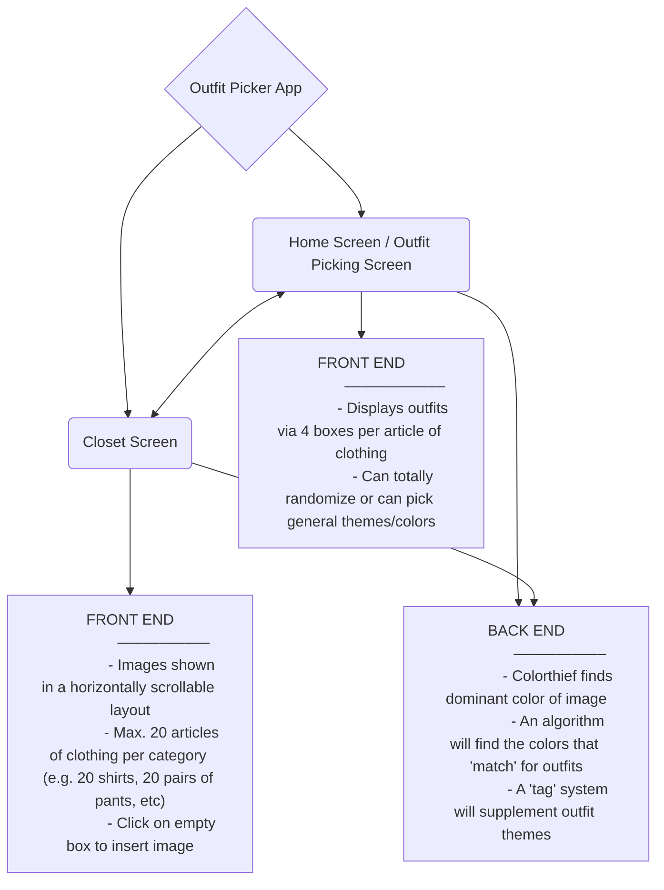

# Outfit Picker

## Quick Summary

Outfit Picker is an app that helps you pick out outfits if you're feeling indecisive. It is currently based solely off of the React.js API Framework. With 2 screens, one being your closet and the other being the outfit generator itself. You can upload images of your clothing into the closet page and insert tags to help the program decide what clothes work with others, another feature for helping decide outfits is the ability for the app to find the dominant color of an image so it can figure out what clothes match with others.

## Getting Started with Outfit Picker

### Available Scripts

In the project directory, you can run:

#### `npm install`

Installs needed dependencies into the node modules folder.
These dependencies include (as of now):
- react
- react dom
- react scripts
- colorthief
- exit hook
- web vitals

#### `npm start`

Runs the app.\
Open [http://localhost:3000](http://localhost:3000) to view it in your browser.

## Compatible Operating Systems

- Windows
- macOS
- Linux

## System Requirements

- Node.js version: ^20.12.2
- NPM version: ^10.5.0

## Library Requirements

1. Core Libraries:

- react: ^18.3.1
- react-dom: ^18.3.1

2. Development Libraries (Testing):

- @testing-library/jest-dom: ^5.17.0
- @testing-library/react: ^13.4.0
 @testing-library/user-event: ^13.5.0

3. Utility Libraries:

- colorthief: ^2.4.0
- exit-hook: ^4.0.0

4. React App Scripts:

- react-scripts: 5.0.1

5. Performance Monitoring:

- web-vitals: ^2.1.4

## Architecture

More to come as developement progresses.
