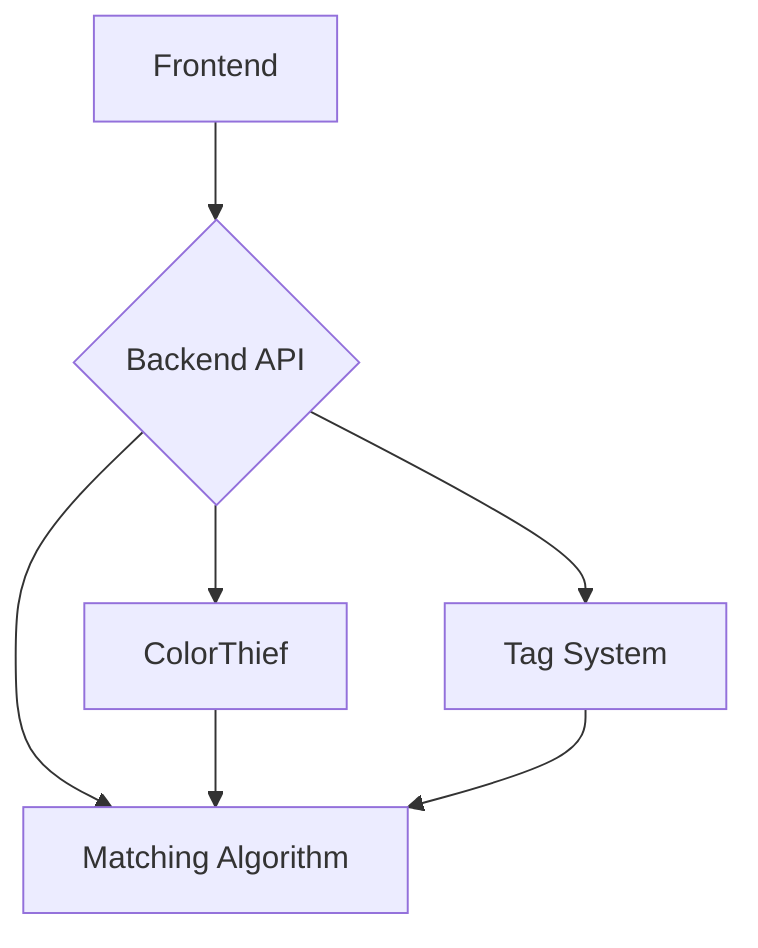

# Outfit Picker

## Quick Summary

Outfit Picker is an app that helps you pick out outfits if you're feeling indecisive. It is currently based solely off of the React.js API Framework. The app utilizes 2 screens:
- **Closet** - Responsible for uploading images of your clothing, inserting tags relevant tags, finding the dominant color of an image.
- **Outfit Generator** - Responsible for displaying images of generated articles of clothing that should work well together.

## Getting Started with Outfit Picker

### Available Scripts

In the project directory, you can run:

#### `npm install`

Installs needed dependencies into the node modules folder.
These dependencies include (as of now):
- react
- react dom
- react scripts
- colorthief
- exit hook
- web vitals

#### `npm start`

Runs the app.\
Open [http://localhost:3000](http://localhost:3000) to view it in your browser.

## Compatible Operating Systems

- Windows
- macOS
- Linux

## System Requirements

- Node.js version: ^20.12.2
- NPM version: ^10.5.0

## Library Requirements

1. Core Libraries:

- react: ^18.3.1
- react-dom: ^18.3.1

2. Development Libraries (Testing):

- @testing-library/jest-dom: ^5.17.0
- @testing-library/react: ^13.4.0
 @testing-library/user-event: ^13.5.0

3. Utility Libraries:

- colorthief: ^2.4.0
- exit-hook: ^4.0.0

4. React App Scripts:

- react-scripts: 5.0.1

5. Performance Monitoring:

- web-vitals: ^2.1.4

## Architecture


## High Level Architecture

### Layers

- Frontend: Responsible for user interaction, displaying clothing options, and generating outfits.
- Backend: Responsible for analyzing images, identifying dominant colors, and performing matching algorithms.

### Core Components

- Outfit Picking Screen:
  	- Displays 4 random clothing items at a time.
  	- Users can choose to randomize completely or set preferences (e.g., colors, tags).
- Closet Screen:
	- Users can upload clothing images and tag them with categories (e.g., shirts, pants, formal, casual).
 	- Displays items in a scrollable view, categorized by clothing type.
- Color Analysis:
	- Uses the ColorThief library to identify the dominant color of each uploaded clothing image.
	- Matching algorithms compare dominant colors to suggest outfits.

### System Diagram



### Class Diagram

```mermaid
flowchart ID
	OutfitPickerApp --> Closet
	OutfitPickerApp --> OutfitGenerator
	Closet --> ClothingItem
	OutfitGenerator --> Outfit
	ClothingItem --> Image
	ClothingItem --> Tags
	Outfit --> MatchingAlgorithm
	MatchingAlgorithm --> ColorThief
```

More to come as developement progresses.
