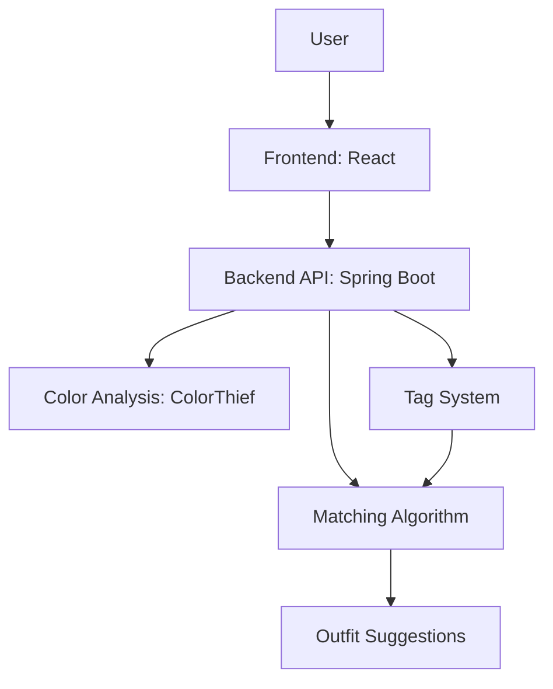
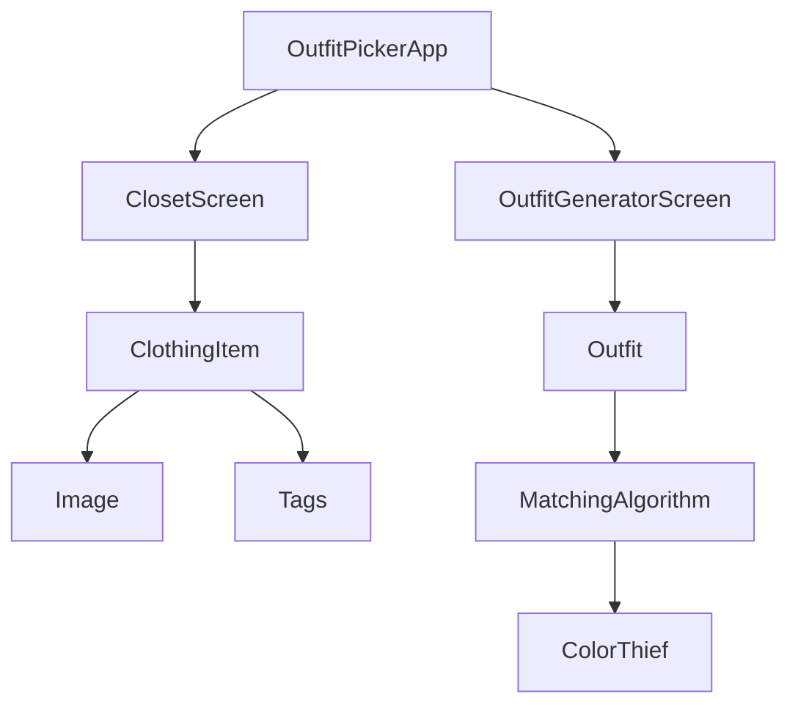
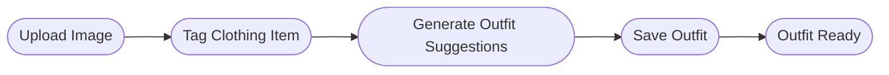

# Outfit Picker

## Quick Summary

Outfit Picker is a React.js-based application designed to assist users in selecting coordinated outfits from their wardrobe. By analyzing uploaded images of clothing items, the app uses color analysis and tagging to suggest complementary outfits, simplifying the process of deciding what to wear.

## Key Features

- **Closet Screen**: Users can upload images of clothing items, add relevant tags (e.g., "casual," "formal"), and determine the dominant color of each item.
- **Outfit Generator Screen**: Generates outfit suggestions that coordinate well based on color analysis and tags, with an option to "re-roll" for new combinations.
- **Randomization**: Offers diverse outfit ideas through randomization.
- **Customization**: Allows users to customize outfits or save favorites for later use.

## Getting Started

### Available Scripts

In the project directory, you can run:

#### `npm install`

Installs all required dependencies into the `node_modules` folder, including:
- React
- colorthief (for color detection)
- exit-hook
- web vitals

#### `npm start`

Launches the application. Open [http://localhost:3000](http://localhost:3000) in your browser to use the app.

## System Requirements

- **Compatible Operating Systems**: Windows, macOS, Linux
- **Node.js Version**: ^20.12.2
- **NPM Version**: ^10.5.0

## Library Requirements

### Core Libraries
- `react`: ^18.3.1
- `react-dom`: ^18.3.1

### Development Libraries (Testing)
- `@testing-library/jest-dom`: ^5.17.0
- `@testing-library/react`: ^13.4.0
- `@testing-library/user-event`: ^13.5.0

### Utility Libraries
- `colorthief`: ^2.4.0
- `exit-hook`: ^4.0.0

### React App Scripts
- `react-scripts`: ^5.0.1

### Performance Monitoring
- `web-vitals`: ^2.1.4

## Architecture Overview

### High-Level Design

#### System Layers
1. **Frontend**: Handles user interaction, displays clothing options, and generates outfits.
2. **Backend**: Processes images, performs color analysis, and matches clothing items based on criteria.

#### Core Components
- **Closet Screen**:
  - Upload and tag clothing items.
  - Display items in a horizontally scrollable view.
  - Identify the dominant color of each item using the ColorThief library.
- **Outfit Generator Screen**:
  - Suggest outfits based on color matching and tags.
  - Provide options to randomize or set preferences.
  - Save favorite outfits.

#### User Interaction
- Upload images of clothing.
- Add tags for categorization (e.g., "formal," "casual").
- Customize outfits or generate suggestions.

### System Diagram

```mermaid
flowchart TD
    User --> Frontend[Frontend: React]
    Frontend --> API[Backend API: Spring Boot]
    API --> ColorThief[Color Analysis: ColorThief]
    API --> MatchingAlgorithm[Matching Algorithm]
    API --> TagSystem[Tag System]
    TagSystem --> MatchingAlgorithm
    MatchingAlgorithm --> OutfitSuggestions[Outfit Suggestions]
```

### Class Diagram

```mermaid
flowchart TD
    OutfitPickerApp --> ClosetScreen
    OutfitPickerApp --> OutfitGeneratorScreen
    ClosetScreen --> ClothingItem
    OutfitGeneratorScreen --> Outfit
    ClothingItem --> Image
    ClothingItem --> Tags
    Outfit --> MatchingAlgorithm
    MatchingAlgorithm --> ColorThief
```

### Workflow Diagram

```mermaid
flowchart LR
    Start([Upload Image]) --> Tag([Tag Clothing Item])
    Tag --> Generate([Generate Outfit Suggestions])
    Generate --> Save([Save Outfit])
    Save --> End([Outfit Ready])
```

### Project Structure
.github/workflows/: GitHub Actions configuration for CI/CD.
.vscode/: Visual Studio Code settings.
public/: Static assets (e.g., index.html).
src/: Source code for components, styles, and utilities.
tests/: Contains test cases to validate functionality.
README.md: Project overview and setup guide.

### How to Run
Clone the repository.
Navigate to the project directory.
Run 'npm install' to install dependencies.
Run 'npm start' to launch the app locally.

